# Feature-Generation-Methods
```
Assignment for: Subject Code: 19AI403
                Subject Name: Introduction to Data Science
                SA Number: A05
                Topic: Feature Generation methods with example code

Written By: Name: Kaushika.A
            Roll Number:212221230048
            Year: I
            Semester: II

```
# Feature Generation:

A feature (or column) represents a measurable piece of data like name, age or gender.It is the basic building block of a dataset. The quality of a feature can vary significantly and has an immense effect on model performance. We can improve the quality of a dataset’s features in the pre-processing stage using processes like Feature Generation.

  > Feature Generation (also known as feature construction, feature extraction or feature engineering) is the process of transforming features into new features that better relate to the target. This can involve mapping a feature into a new feature using a function like log, or creating a new feature from one or multiple features using multiplication or addition.

Feature Generation involves two techniques:
- Feature Encoding
- Feature Scaling

# Feature Encoding:
Categorical feature encoding is often a key part of the data science process and can be done in multiple ways leading to different results and a different understanding of input data.

>### Why Encode Categorical Data?
Most of the algorithms cannot handle the categorical variables unless they are converted into a numerical value.

We encode categorical data numerically because math is generally done using numbers. A big part of natural language processing is converting text to numbers. Just like that, our algorithms cannot run and process data if that data is not numerical. Therefore, data scientists need to have tools at their disposal to transform colors like red, yellow, and blue into numbers like 1, 2, and 3 for all the backend math to take place. 

>Categorical features are generally divided into 3 types:

- Binary: Either 0 or 1 (Examples:Yes, No)
- Ordinal: Specific ordered Groups (Examples:low, medium, high)
- Nominal: Unordered Groups (Examples:North, South, East, West)

## Feature Encoding methods:
First lets read out dataset:
```python

# data preprocessing
import pandas as pd 
import numpy as np   
import seaborn as sns
df = pd.read_csv("Encoding Data.csv")
df.head(10)  
```
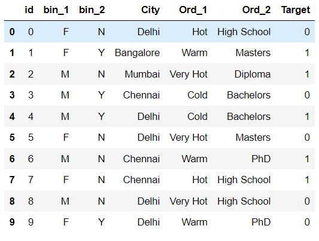
Lets’ examine the columns of the dataset with different types of encoding techniques. 
## Binary Encoding:
Binary encoding converts a category into binary digits. Each binary digit creates one feature column. If there are n unique categories, then binary encoding results in the only log(base 2)ⁿ features.
The categories are first converted to numeric order starting from 1.
Then the digits of the binary number form separate columns.
### Example:
```python
import category_encoders as ce
be=ce.BinaryEncoder()
ndf=be.fit_transform(df["bin_1"])
df["bin_1"] = be.fit_transform(df["bin_1"])
df["bin_2"] = be.fit_transform(df["bin_2"])
ndf
```
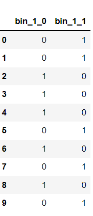
## Label encoding and ordinal encoding:
Label encoding algorithm is quite simple and it considers an order for encoding, Hence can be used for encoding ordinal data. 

We can use Ordinal Encoding provided in Scikit learn class to encode Ordinal features. It ensures that ordinal nature of the variables is sustained. It can be used in nominal data too when providing categories.
### Example:
```python
from sklearn.preprocessing import LabelEncoder,OrdinalEncoder
le=LabelEncoder()
df['Ord_1'] = le.fit_transform(df[["Ord_1"]])

edu=['High School','Diploma','Bachelors','Masters','PhD']
oe=OrdinalEncoder(categories=[edu])
df['Ord_2']= oe.fit_transform(df[["Ord_2"]])
```
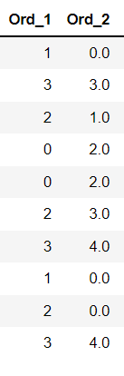
## Mean Encoding:
In mean target encoding for each category in the feature label is decided with the mean value of the target variable on a training data. This encoding method brings out the relation between similar categories, but the connections are bounded within the categories and target itself. 
The advantages of the mean target encoding are that it does not affect the volume of the data and helps in faster learning
Mean encoding approach is as below:
1. Select a categorical variable you would like to transform
2. Group by the categorical variable and obtain aggregated sum over the “Target” variable. 
(total number of 1’s for each category in ‘Temperature’)
3. Group by the categorical variable and obtain aggregated count over “Target” variable
4. Divide the step 2 / step 3 results and join it back with the train.

using Ord_2 separately for this method
### Example:
```python
from category_encoders import TargetEncoder
te = TargetEncoder()
ndf2=te.fit_transform(X = df.Ord_2, y = df.Target)
ndf2
```
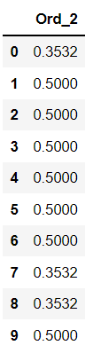

## One Hot Encoding:
To overcome the Disadvantage of Label Encoding as it considers some hierarchy in the columns which can be misleading to nominal features present in the data. we can use One-Hot Encoding strategy. 
One-hot encoding is processed in 2 steps:

1. Splitting of categories to different columns.
2. Put ‘0 for others and ‘1’ as an indicator for the appropriate column.

This method is more preferable since it gives good labels. 
> Note: One-hot encoding approach eliminates the order but it causes the number of columns to expand vastly. So for columns with more unique values try using other techniques.

>Frequency Encoding: We can also encode considering the frequency distribution. This method can be effective at times for nominal features.

### Example:
```python
from sklearn.preprocessing import OneHotEncoder
ohe=OneHotEncoder(sparse=False)
df["City"] = ohe.fit_transform(df[["City"]])
```
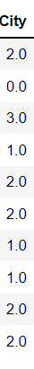

The final Encoded dataset will look like this:
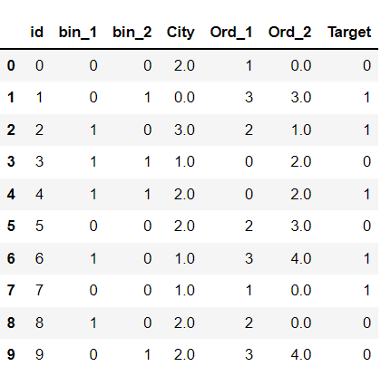

# Feature Scaling:
Feature Scaling is one such process in which we transform the data into a better version. Feature Scaling is done to normalize the features in the dataset into a finite range.
Real Life Datasets have many features with a wide range of values like for example let’s consider the house price prediction dataset. It will have many features like no. of. bedrooms, square feet area of the house, etc.

Many machine learning algorithms that are using Euclidean distance as a metric to calculate the similarities will fail to give a reasonable recognition to the smaller feature, in this case, the number of bedrooms, which in the real case can turn out to be an actually important metric.

Eg: Linear Regression, Logistic Regression, KNN

> There are several ways to do feature scaling
1. Absolute Maximum Scaling
2. Min-Max Scaling
3. Normalization
4. Robust Scaling

## Absolute Maximum Scaling:


- Find the absolute maximum value of the feature in the dataset
- Divide all the values in the column by that maximum value

If we do this for all the numerical columns, then all their values will lie between -1 and 1. The main disadvantage is that the technique is sensitive to outliers. Like consider the feature *square feet*, if 99% of the houses have square feet area of less than 1000, and even if just 1 house has a square feet area of 20,000, then all those other house values will be scaled down to less than 0.05.

We shall use our Encoded dataset to perform scaling:
### Example:
```python
from sklearn.preprocessing import MaxAbsScaler
sc2=MaxAbsScaler()
df4=pd.DataFrame(sc2.fit_transform(df),columns=['id', 'bin_1', 'bin_2', 'City', 'Ord_1','Ord_2','Target'])
df4
```
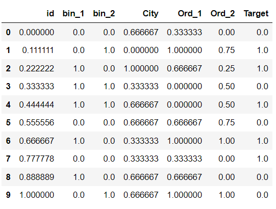

## Min Max Scaling:
In  min-max you will subtract the minimum value in the dataset with all the values and then divide this by the range of the dataset(maximum-minimum). In this case, your dataset will lie between 0 and 1 in all cases whereas in the previous case, it was between -1 and +1. Again, this technique is also prone to outliers.
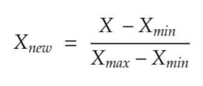

### Example:
```python
from sklearn.preprocessing import MinMaxScaler
sc=MinMaxScaler()
df2=pd.DataFrame(sc.fit_transform(df),columns=['id', 'bin_1', 'bin_2', 'City', 'Ord_1','Ord_2','Target'])
df2
```
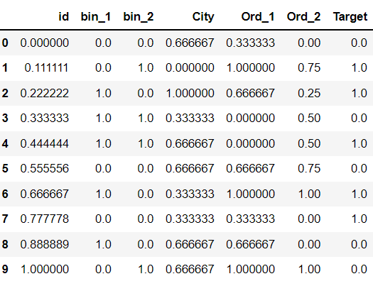

## Standardization:
In standardization, we calculate the z-value for each of the data points and replaces those with these values.
This will make sure that all the features are centred around the mean value with a standard deviation value of 1. This is the best to use if your feature is normally distributed like salary or age.
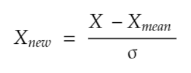
### Example:
```python
from sklearn.preprocessing import StandardScaler
sc1=StandardScaler()
df3=pd.DataFrame(sc1.fit_transform(df),columns=['id', 'bin_1', 'bin_2', 'City', 'Ord_1','Ord_2','Target'])
df3
```
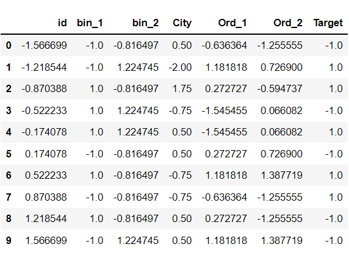

## Robust Scaling:
In this method, you need to subtract all the data points with the median value and then divide it by the Inter Quartile Range(IQR) value.
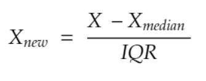
IQR is the distance between the 25th percentile point and the 50th percentile point.

This method centres the median value at zero and this method is robust to outliers.
### Example:
```python
from sklearn.preprocessing import RobustScaler
sc3=RobustScaler()
df5=pd.DataFrame(sc3.fit_transform(df),columns=['id', 'bin_1', 'bin_2', 'City', 'Ord_1','Ord_2','Target'])
df5
```
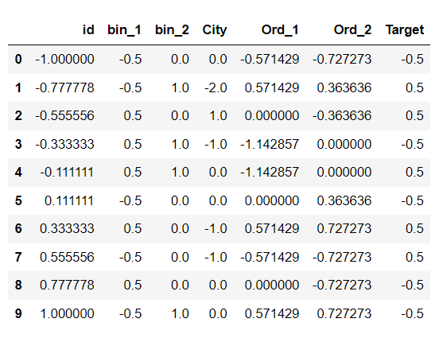